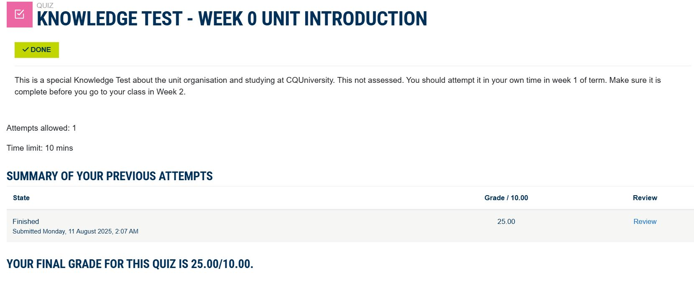

# Week 01: Unit Introduction

## Task 5. Write Your Entry for Week 1 Journal 

I have an above-average understanding of computer networking, the Internet, cybersecurity, and cloud computing, gained through both formal studies and hands-on experience. My networking knowledge covers IPv4 and IPv6 addressing, subnetting, VLAN configuration, and routing protocols (RIP, OSPF). I have configured Cisco routers and switches using CLI, set up home and office wireless access points, and used Linux commands (ifconfig, ip addr) to troubleshoot connections. I understand key Internet concepts such as DNS, HTTP/HTTPS, and TCP/IP layers. In cybersecurity, I am familiar with public key cryptography, SSL/TLS, firewalls, and intrusion detection basics, having used tools like Wireshark for packet analysis. My cloud computing knowledge include theoretical basic information on virtual machines in AWS and Azure, setting up storage buckets, and configuring security groups. This knowledge comes from my IT degree courses such as “Computer Networks,” “Cybersecurity Fundamentals,” and “Cloud Computing,” supplemented by practical lab exercises and personal projects.

