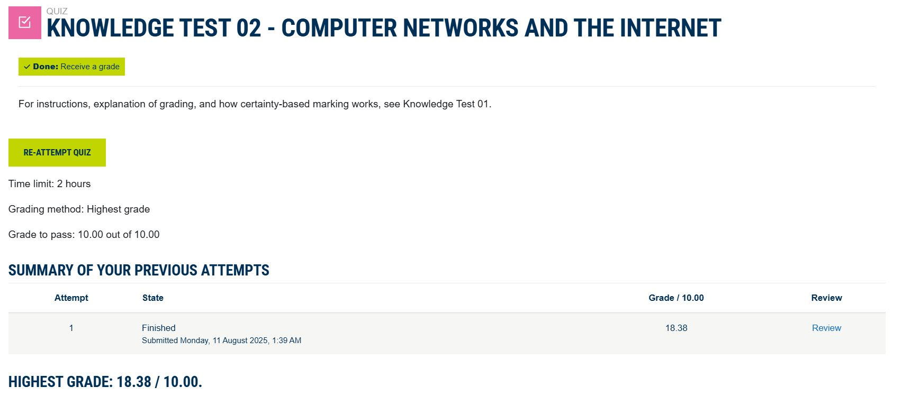
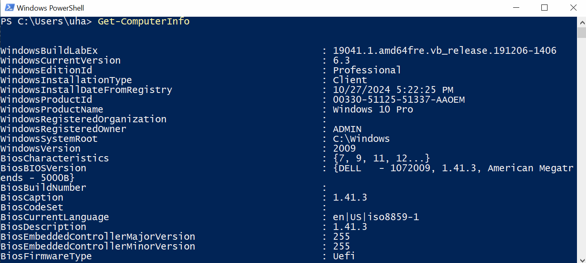
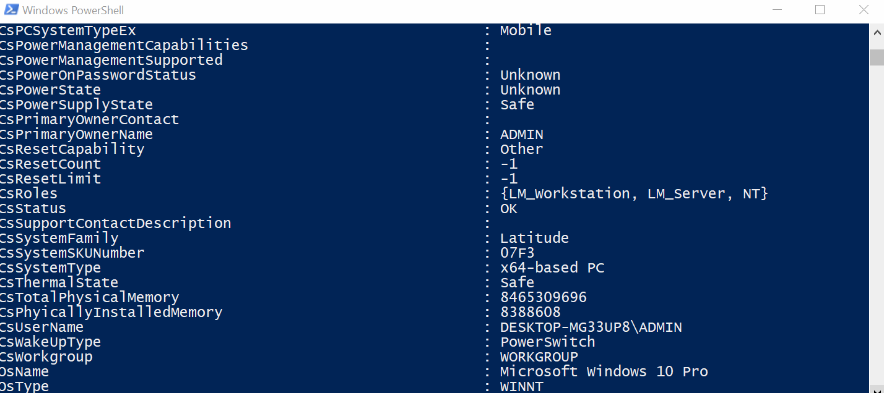
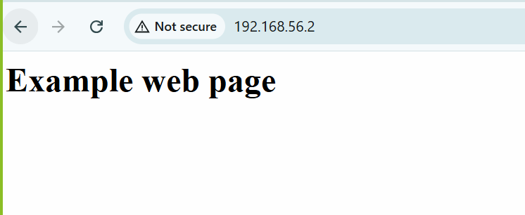
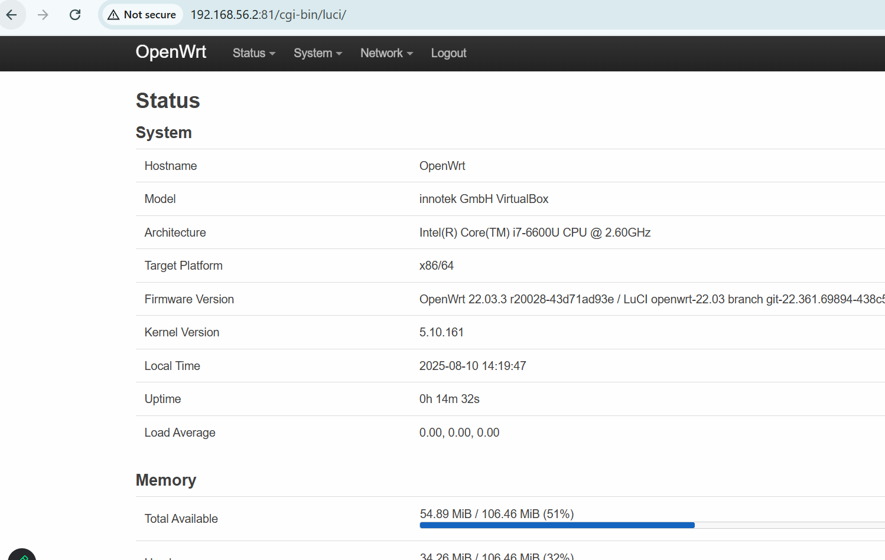
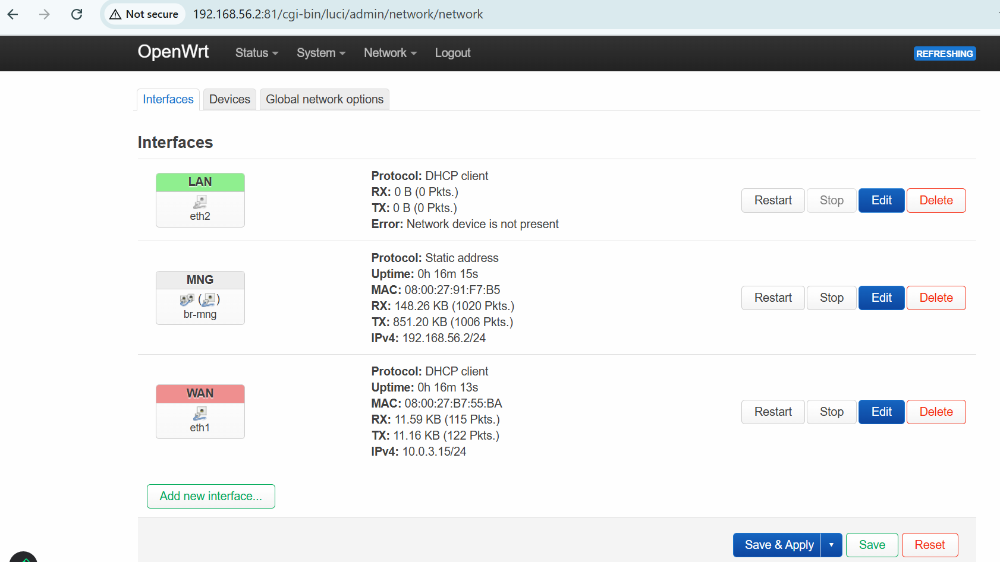

# Week 02: Computer Systems and Applications

## Task 1: Complete the Knowledge Test 

## Task 2. View Your Computer Information 

## Task 3. Deploy Linux Web Server in VirtualBox

Boot Manager and Kernel

After importing the OpenWRT Linux appliance into VirtualBox and starting the VM, I observed the boot process via the VirtualBox console. The boot manager displayed was GRUB 2 (GNU GRUB version 2.06). This is a common open-source bootloader used in many Linux-based systems to load the kernel and pass control to it. Shortly after, the kernel loaded was Linux kernel version 5.10.176. I found these values by closely watching the boot messages in the VirtualBox VM window, specifically during the initial boot phase where GRUB lists its version and where the Linux kernel banner appears.

Description of VirtualBox and OpenWRT

VirtualBox is a free and open-source virtualization platform developed by Oracle. It allows a host computer to run multiple operating systems as virtual machines (VMs) without affecting the host OS. It is widely used for testing software, running isolated environments, and learning different OS configurations without needing extra physical hardware. VirtualBox supports various guest operating systems, including Linux, Windows, BSD, and macOS (limited).

OpenWRT is a lightweight Linux-based operating system designed primarily for networking devices like routers, access points, and embedded systems. It offers advanced networking features such as VLANs, VPN support, firewall configuration, and package management. Unlike stock router firmware, OpenWRT is highly customizable and allows users to install additional software packages to extend its functionality. In this lab, OpenWRT is run as a VM in VirtualBox, which allows safe experimentation without needing a physical router.

AI-Generated Description (Prompt & Response)

Prompt Used:

"Explain in simple terms what VirtualBox and OpenWRT are, as if teaching a new IT student."

AI Response:

VirtualBox is a program that lets you run other operating systems on your computer without removing or replacing the one you already have. It creates a “virtual” computer inside your real computer, where you can install and use different systems like Linux, Windows, or macOS.

OpenWRT is a special kind of Linux made for routers and network devices. It replaces the basic software that comes with a router, giving you more control and more features, like better security, VPNs, and advanced network settings. You can use it to turn a regular router into a powerful, customizable networking tool.

Comparison & Reflection

My description of VirtualBox and OpenWRT focused on technical accuracy and mentioned specific use cases, supported systems, and advanced features. The AI description, while accurate, uses simpler and more accessible language aimed at beginners, avoiding technical terms like “VLAN” or “package management.” The AI’s explanation would be ideal for someone with no prior exposure to virtualization or networking, whereas mine would better serve students with some technical background. The main difference lies in the depth and level of technical detail.

## Task 4. Browse to OpenWRT Websites

