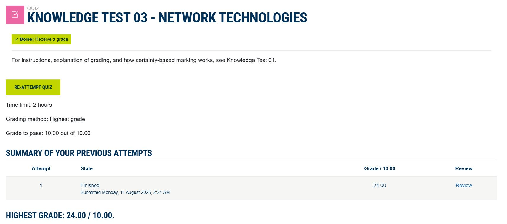
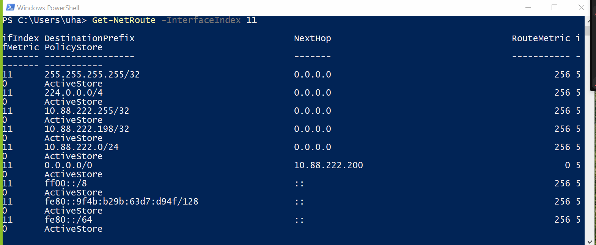
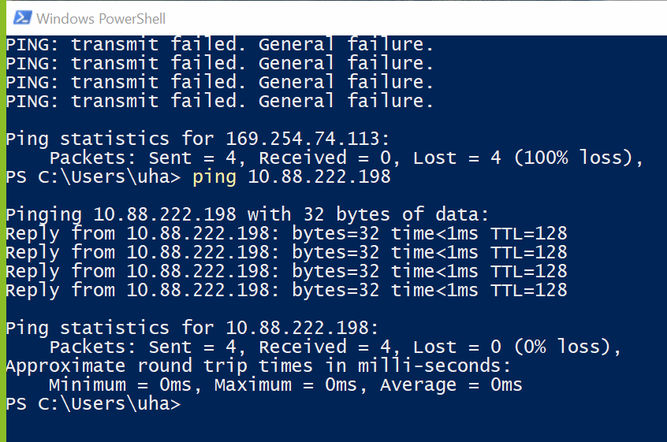
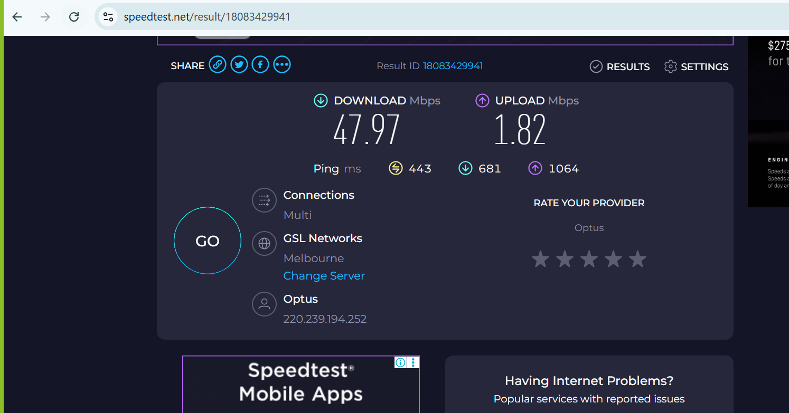

# Week 03: Computer Networks and the Internet

## Task 1. Complete the Knowledge Test

## Task 2. View Your Addresses 

## Task 3. Ping Your Local Router

The local router ip is 10.88.222.198. The above result shows the ping result.

the minimum, maximum and average is 0 ms. 

This is because there is no intermediate traffic. 

The main reason for these values go high is if there is any network traffic or it travels more than one network.

The delays could be caused due to bandwidth, distance factor, firewall and server load.

## Task 4. Ping your OpenWRT Linux Server 

## Task 5. Academic Integrity Policy

## Task 6. Print GitHub Journal Page to PDF

## Task 7. Find Addresses of a Website

## Task 8. Home Internet Connection

