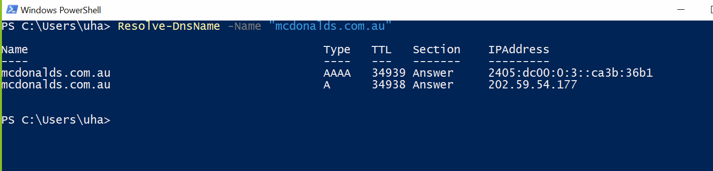

# Week 03: Computer Networks and the Internet

## Task 1. Complete the Knowledge Test

## Task 2. View Your Addresses 

## Task 3. Ping Your Local Router

The local router ip is 10.88.222.198. The above result shows the ping result.

the minimum, maximum and average is 0 ms. 

This is because there is no intermediate traffic. 

The main reason for these values go high is if there is any network traffic or it travels more than one network.

The delays could be caused due to bandwidth, distance factor, firewall and server load.

## Task 4. Ping your OpenWRT Linux Server 

### Commands used are as follows

Packet capturing command: tcpdump -i eth0 -n -w week3task4-ping.pcap 'arp or icmp'

Ping command: ping 192.168.56.2 from the local system

## Task 5. Academic Integrity Policy

The academic integrity policy pdf is uploaded into the images folder.

-_Inappropriate academic conduct (level 1 breach of academic integrity)_

__Academic misconduct:__

-_minor academic misconduct (level 2 breach of academic integrity)_

-_moderate academic misconduct (level 3 breach of academic integrity)_ 

-_substantial academic misconduct (level 4 breach of academic integrity)_

-_serious academic misconduct (level 5 breach of academic integrity)_

## Task 6. Print GitHub Journal Page to PDF

## Task 7. Find Addresses of a Website

The website chosen is mcdonalds.com.au

IP address - 202.59.54.177

The command used is ___Resolve-DnsName -Name "mcdonalds.com.au"___

## Task 8. Home Internet Connection

